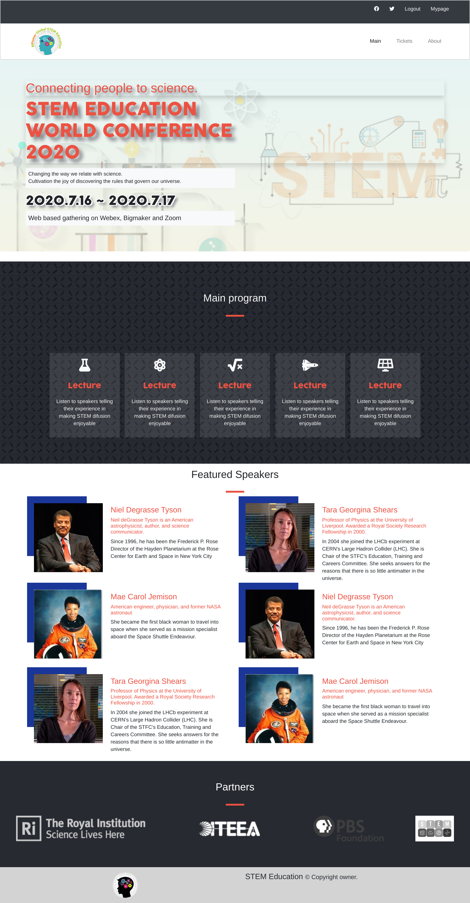
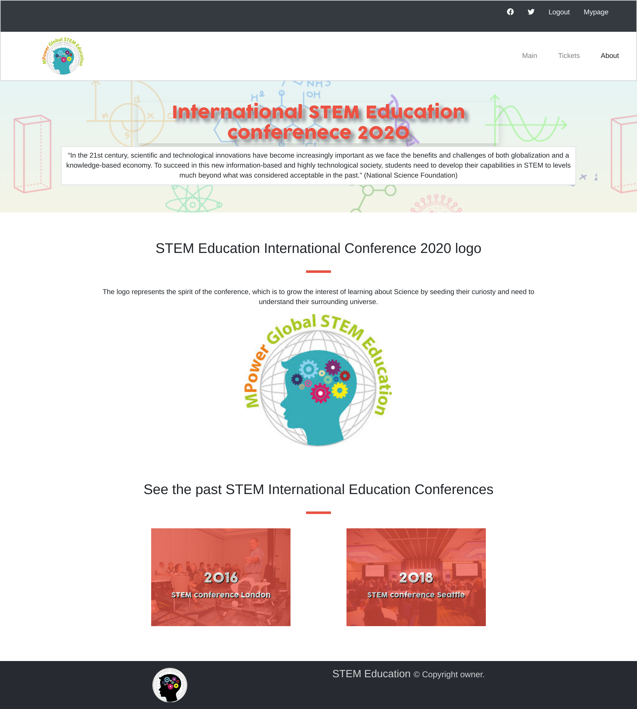
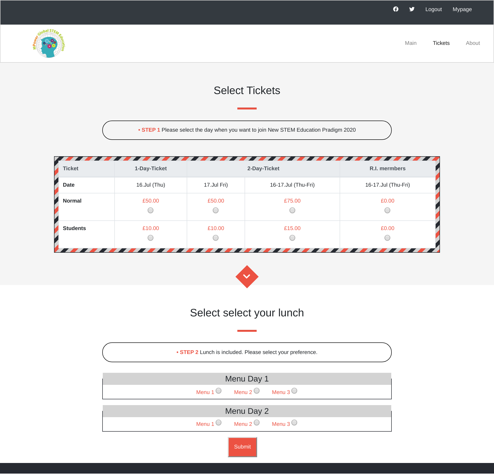
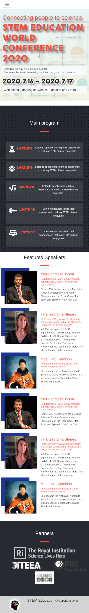
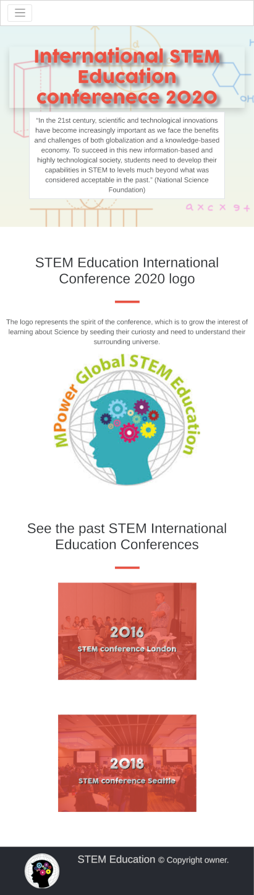
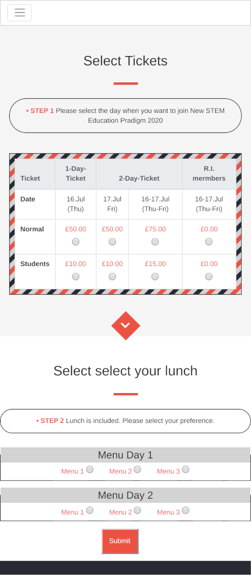

#  STEM INTERNATIONAL CONFERENCE
>This project presents a website for a conference about STEM education. It was created as Capstone Project for the HTML/CSS part of the Microverse program. It consists of tree web pages:
- index.html
- tickets.html
- about.html 
And a stylesheet:
- style.css

The site uses the following color scheme
  -primary:#ec5242;
  -light:#D3D3D3;
  -dark:#272A31;

Contrast with the backgrounds was increased by using shadows and by treating the images with opacity filters and gradient overlays.

The site is responsive with a break point at 768 pixels.

Different techniques were used to perform the layout. Boostrap was used in the collapsible navbar and the tickets page. Flexbox and Grid were used in the rest of the pages.

## Built With

- CSS/HTML
- Flex, Grid, Float and Bootstrap

## Live Demo

[Live Demo Link](https://raw.githack.com/gdumani/STEM-conf-Capstone/Feature-branch/index.html)

### Prerequisites
Modern browser
- It was tested on Chrome 80 and Firefox 73 and chrome for Android

## Author

👤 
Giancarlo Dumani

- Github: [@githubhandle](https://github.com/gdumani
- Twitter: [@twitterhandle](https://twitter.com/gdumani1
- Linkedin: [linkedin](https://www.linkedin.com/in/giancarlo-dumani-a7364a1a1/)

## 🤝 Contributing

Contributions, issues and feature requests are welcome!

Feel free to check the [issues page](issues/).

## Show your support

Give a ⭐️ if you like this project!

## Acknowledgments

- This project was part of Microverse's curriculum in CSS/HTML learning program

## 📝 License

This project is [MIT](lic.url) licensed.